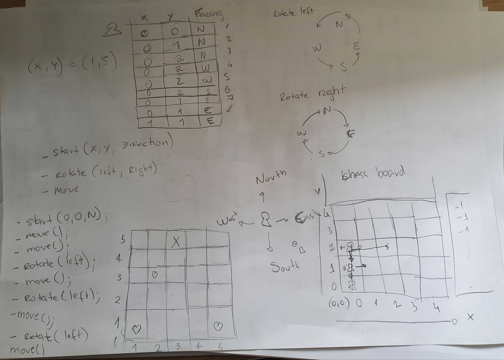

#Resources

This folder contains a warm up resource file called `robot_warmup.txt`.

The warm-up file is a simple `.txt` file that contains a sequence of commands that will be
sent to the robot during the warm-up.

Each line should represents a single command.

During the warm-up phrase, the cli will read that file and send all the commands to the robot
the same way it would happen if someone was typing it.

Feel free to edit the file to add and remove commands and all changes will be reflected inside the container
 

## Robot sketch

